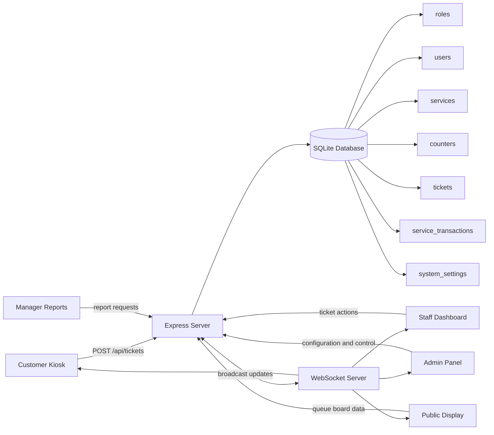
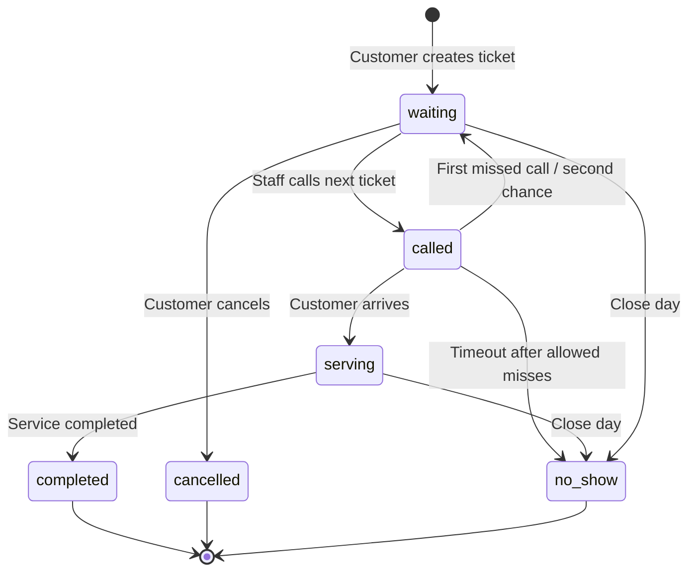
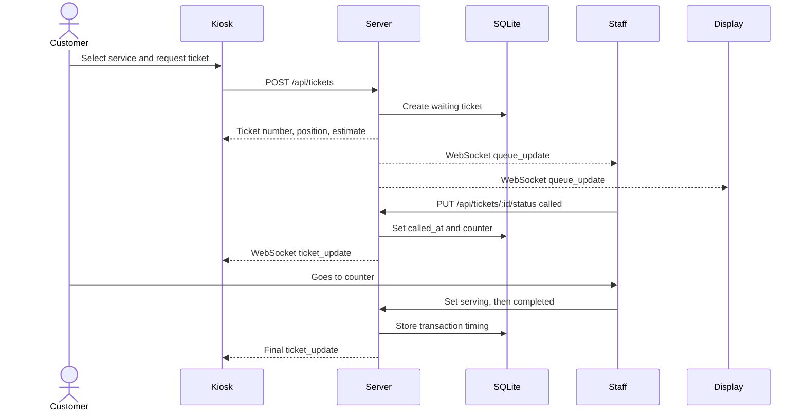

# SmartQueue Final Project Documentation

SmartQueue is a digital queue management system for issuing customer tickets, calling customers to service counters, monitoring live queue status, and producing administrative and manager reports. It is built with Node.js, Express.js, SQLite, WebSockets, HTML, CSS, and JavaScript.

## Project Details

| Item | Description |
|---|---|
| Project name | SmartQueue |
| Project type | Web-based digital queue management system |
| Backend | Node.js, Express.js |
| Frontend | HTML5, CSS3, JavaScript |
| Database | SQLite |
| Real-time updates | WebSocket |
| Authentication | Express session, bcrypt password hashing |
| Main server file | `server/app.js` |
| Database file | `database/smartqueue.db` |

## System Objectives

- Replace manual queue handling with digital ticket generation.
- Allow customers to select a service and receive a queue number.
- Allow staff to call, serve, complete, cancel, or mark tickets as no-show.
- Provide a public display screen for waiting customers.
- Give administrators tools for services, counters, users, settings, transfer, and close-day operations.
- Give managers focused reports with CSV export and print/PDF support.
- Keep all queue screens synchronized in real time.

## Snapshots

The following snapshots are included in `docs/snapshots/` as lightweight project visuals.

| Screen | Snapshot |
|---|---|
| Customer kiosk service selection | [01-kiosk-services.svg](docs/snapshots/01-kiosk-services.svg) |
| Customer ticket view | [02-ticket-view.svg](docs/snapshots/02-ticket-view.svg) |
| Public queue display | [03-public-display.svg](docs/snapshots/03-public-display.svg) |
| Admin/Manager login flow | [04-admin-manager-login.svg](docs/snapshots/04-admin-manager-login.svg) |

Note: I also attempted real PNG capture through Chrome and Edge headless, but both failed in this Windows sandbox because the browser GPU process could not initialize. When running on a normal desktop session, use the snapshot command in the Appendix to regenerate live PNG screenshots.

## System Architecture



Diagram source: [docs/diagrams/system-architecture.mmd](docs/diagrams/system-architecture.mmd)

## Ticket Lifecycle



Diagram source: [docs/diagrams/ticket-lifecycle.mmd](docs/diagrams/ticket-lifecycle.mmd)

## Main User Flow



Diagram source: [docs/diagrams/user-flow.mmd](docs/diagrams/user-flow.mmd)

## User Interfaces

| Interface | Route | Purpose |
|---|---|---|
| Customer Kiosk | `/` | Customers select a service, generate tickets, monitor ticket status, print/copy/share ticket links, and cancel active tickets. |
| Staff Dashboard | `/staff` | Staff log in, view the assigned service queue, call customers, start serving, complete tickets, mark no-shows, and view history. |
| Staff History | `/staff/history` | Staff can review recently handled completed, no-show, and cancelled tickets. |
| Admin Panel | `/admin` | Admins manage services, counters, users, queue records, analytics, settings, ticket transfer, and close-day operations. |
| Manager Reports | `/manager` | Managers generate summary, active queue, service, counter, peak-hour, no-show, and ticket detail reports. |
| Public Display | `/display` | Waiting-area screen showing active queues by counter and live ticket status. |

## Core Features

- Digital service-based ticket generation.
- Ticket numbers generated from service abbreviations, for example `GS-001`.
- Estimated wait time using recent service transaction averages.
- Multiple service counters.
- Real-time WebSocket updates across kiosk, staff, admin, and display screens.
- Staff-only queue visibility based on assigned counter/service.
- Second-chance missed ticket handling.
- Automatic no-show handling after timeout.
- Customer ticket sharing through ticket link and QR code.
- Close-day operation that marks active tickets as no-show.
- Admin ticket transfer between services/counters.
- Manager report generation with CSV export and print/PDF option.
- Session-based role access control.

## Installation

Prerequisites:

- Node.js v14 or newer
- npm

Commands:

```bash
npm install
npm start
```

Development mode:

```bash
npm run dev
```

Default local URLs:

| Page | URL |
|---|---|
| Kiosk | `http://localhost:3000/` |
| Staff | `http://localhost:3000/staff` |
| Admin | `http://localhost:3000/admin` |
| Manager | `http://localhost:3000/manager` |
| Display | `http://localhost:3000/display` |

## Login Credentials

| Role | Username | Password |
|---|---|---|
| Admin | `admin` | `admin123` |
| Manager | `manager` | `manager123` |
| Staff example | `counter1` | `password` |

The current database also contains staff users assigned to Counter 1, Counter 2, and Counter 3. Admin users can add or edit staff accounts from the Admin Panel.

## Database Design

| Table | Purpose |
|---|---|
| `roles` | Stores role names and permissions. |
| `users` | Stores authenticated users, password hashes, roles, and assigned counters. |
| `services` | Stores available services and default average service time. |
| `counters` | Stores service counters, location, active status, and assigned service. |
| `tickets` | Stores customer ticket number, service, counter, status, missed calls, and timestamps. |
| `service_transactions` | Stores service start/completion timing for analytics and moving averages. |
| `notifications` | Reserved table for notification status tracking. |
| `system_settings` | Stores runtime settings such as timeout, second-chance limit, ring duration, and refresh interval. |

Important relationships:

- A user belongs to one role.
- A staff user can be assigned to one counter.
- A counter belongs to one service.
- A ticket belongs to one service and may be assigned to one counter.
- A service transaction connects a ticket with the counter that served it.

## API Summary

| Method | Endpoint | Access | Purpose |
|---|---|---|---|
| `POST` | `/api/login` | Public | Authenticate user. |
| `GET` | `/api/session` | Authenticated | Validate current session. |
| `POST` | `/api/logout` | Public | Destroy session. |
| `GET` | `/api/services` | Public | List active services. |
| `POST` | `/api/services` | Admin | Create service. |
| `PUT` | `/api/services/:id` | Admin | Update service. |
| `DELETE` | `/api/services/:id` | Admin | Deactivate service. |
| `GET` | `/api/counters` | Public | List active counters. |
| `POST` | `/api/counters` | Admin | Create counter. |
| `PUT` | `/api/counters/:id` | Admin | Update counter. |
| `DELETE` | `/api/counters/:id` | Admin | Deactivate counter. |
| `POST` | `/api/tickets` | Public | Generate customer ticket. |
| `GET` | `/api/tickets/:ticketId` | Public | View one ticket. |
| `GET` | `/api/tickets/all/:serviceId` | Public | View all tickets for a service. |
| `GET` | `/api/queue/:serviceId` | Public | View active queue for a service. |
| `PUT` | `/api/tickets/:ticketId/status` | Admin, Staff | Update ticket status. |
| `PUT` | `/api/tickets/:ticketId/cancel` | Public | Cancel active customer ticket. |
| `PUT` | `/api/tickets/:ticketId/transfer` | Admin, Manager | Transfer active ticket. |
| `POST` | `/api/admin/close-day` | Admin | Close active tickets as no-show. |
| `GET` | `/api/users` | Admin | List users. |
| `POST` | `/api/users` | Admin | Create user. |
| `PUT` | `/api/users/:id` | Admin | Update user. |
| `DELETE` | `/api/users/:id` | Admin | Delete user. |
| `GET` | `/api/settings` | Admin | Read system settings. |
| `PUT` | `/api/settings` | Admin | Update system settings. |
| `GET` | `/api/public-settings` | Public | Read safe public settings. |

## Project Structure

```text
smart-queue/
|-- database/
|   `-- smartqueue.db
|-- docs/
|   |-- diagrams/
|   `-- snapshots/
|-- public/
|   |-- css/
|   |-- js/
|   |-- admin.html
|   |-- display.html
|   |-- kiosk.html
|   |-- manager.html
|   |-- staff-history.html
|   `-- staff.html
|-- server/
|   |-- app.js
|   `-- database.js
|-- package.json
|-- README.md
|-- USER_GUIDE.md
`-- FINAL_DOCUMENTATION.md
```

## Security Controls

- Passwords are hashed using bcrypt.
- Sessions are handled using `express-session`.
- Role-based access protects admin, staff, and manager actions.
- SQL queries use parameterized statements for user-supplied values.
- Staff accounts are scoped to assigned counters/services.
- Production cookies are configured as secure when `NODE_ENV=production`.

## Testing Checklist

| Test Area | Expected Result |
|---|---|
| Start server | App starts on port `3000`. |
| Kiosk service load | Services appear with assigned counters and average wait time. |
| Ticket generation | New ticket is created with number, queue position, and estimate. |
| Staff login | Staff can access only their assigned counter queue. |
| Call ticket | Customer ticket status changes from waiting to called. |
| Start service | Ticket changes from called to serving. |
| Complete service | Ticket changes to completed and transaction timing is recorded. |
| No-show timeout | Called ticket returns to waiting once, then becomes no-show after allowed misses. |
| Public display | Queue board updates after ticket creation and status changes. |
| Admin service/counter/user management | Admin can create, edit, and deactivate system records. |
| Manager report | Report can be generated and exported as CSV. |
| Close day | Active tickets are closed as no-show. |

## Deployment Notes

The project includes:

- `Dockerfile` for container deployment.
- `render.yaml` for Render-style deployment configuration.
- Environment variable support through the server process.

Recommended production environment variables:

```text
PORT=3000
NODE_ENV=production
SESSION_SECRET=replace-with-a-strong-secret
DATABASE_PATH=./database/smartqueue.db
```

## Conclusion

SmartQueue provides a complete queue workflow from ticket creation to service completion, while keeping customers, staff, administrators, managers, and public display screens synchronized. The project is suitable for small offices, service desks, clinics, student support counters, and similar environments that need simple real-time queue control.

## Appendix: Regenerating Live PNG Snapshots

Run the server first:

```bash
npm start
```

Then use Chrome or Edge in a normal desktop session:

```powershell
$chrome = "C:\Program Files\Google\Chrome\Application\chrome.exe"
& $chrome --headless=new --window-size=1366,768 --virtual-time-budget=3000 --screenshot="docs\snapshots\kiosk.png" "http://localhost:3000/"
& $chrome --headless=new --window-size=1366,768 --virtual-time-budget=3000 --screenshot="docs\snapshots\display.png" "http://localhost:3000/display"
& $chrome --headless=new --window-size=1366,768 --virtual-time-budget=3000 --screenshot="docs\snapshots\staff-login.png" "http://localhost:3000/staff"
& $chrome --headless=new --window-size=1366,768 --virtual-time-budget=3000 --screenshot="docs\snapshots\admin-login.png" "http://localhost:3000/admin"
& $chrome --headless=new --window-size=1366,768 --virtual-time-budget=3000 --screenshot="docs\snapshots\manager-login.png" "http://localhost:3000/manager"
```
